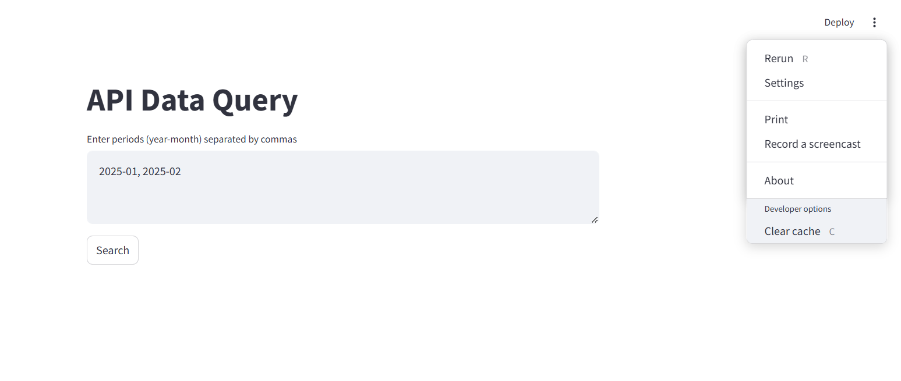

# API Data Query Application

A Streamlit application to query paginated API data by specified year-month periods and export results to Excel.

## Demo


## Features
- Multi-period query capability
- Automatic pagination handling
- Excel export functionality
- Data preview in app

## Requirements
- Python 3.7+
- Streamlit
- Pandas
- Requests
- Openpyxl (for Excel export)

## Installation
```bash
git clone https://github.com/rutecintra/export-data-api.git
cd export-data-api
pip install -r requirements.txt